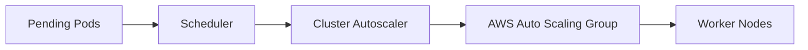

## Overview

Cluster Autoscaler Lab is a project for testing how pending pods, node groups, taints, requests, and scheduling constraints affect autoscaling decisions.

## Motivation

Autoscaling is often treated as a checkbox, but the behavior depends on workload requests, node capacity, cloud provider limits, and scheduler signals. This lab makes those interactions visible.

## Architecture

## Design decisions

- Use Terraform to keep the AWS environment reproducible.
- Keep workload fixtures small and easy to change.
- Capture scheduler and autoscaler logs for each scenario.
- Test both scale-up and scale-down behavior.

## Challenges

Autoscaling bugs are frequently configuration bugs. Resource requests, topology constraints, taints, and max node group size can all produce similar symptoms.

## Lessons learned

The fastest way to debug autoscaling is to compare what the scheduler cannot place with what the autoscaler is allowed to create.

## Screenshots

## Future improvements

- Add scenario-based runbooks.
- Compare managed node groups and self-managed groups.
- Add Grafana dashboard examples.
- Publish Terraform modules for the lab.
