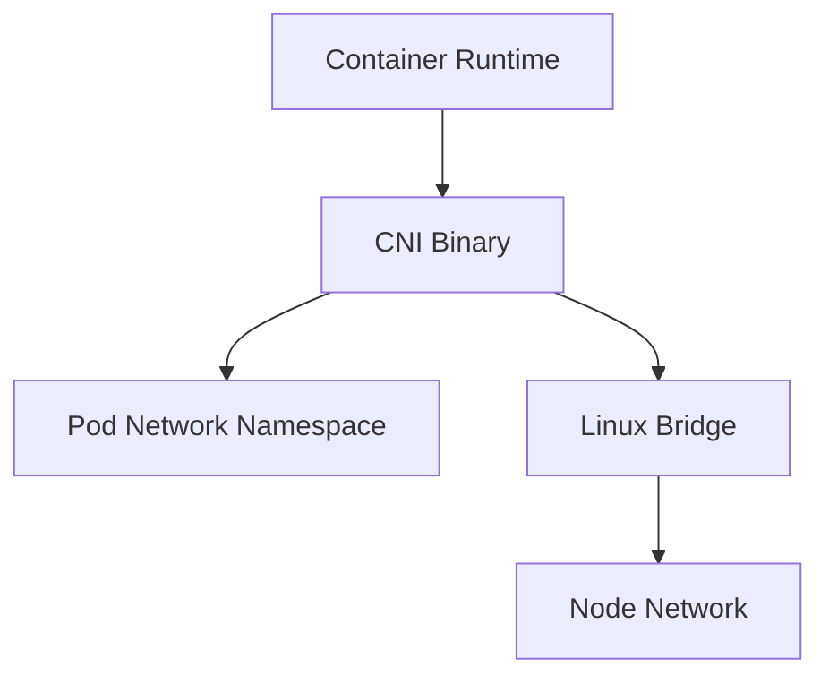

## Overview

Minimal CNI Plugin is a learning project focused on pod networking fundamentals: network namespaces, veth pairs, routes, bridge devices, and basic packet forwarding.

## Motivation

Kubernetes networking can feel abstract until the Linux primitives are visible. Building a small CNI implementation is a practical way to understand how pods get interfaces, IP addresses, routes, and connectivity.

## Architecture



| Layer | Tooling |
| --- | --- |
| Namespace | `ip netns` |
| Interfaces | veth pairs |
| Forwarding | Linux bridge |
| Policy | iptables |

## Design decisions

- Keep the plugin single-node first.
- Use plain Linux networking commands during prototyping.
- Make IP allocation deterministic for easier debugging.
- Document every command the plugin translates into Go.

## Challenges

Networking failures are often silent. The main debugging loop is checking interfaces, routes, ARP, DNS, and packet filtering in the correct namespace.

```bash
ip link show
ip route
iptables -t nat -L -n -v
```

## Lessons learned

Understanding pod networking starts with understanding the node. The Kubernetes abstraction is easier to operate when the Linux model is clear.

## Screenshots


## Future improvements

- Add multi-node routing.
- Replace shell prototypes with Go netlink calls.
- Add e2e tests with kind.
- Document packet flow from pod to service.
