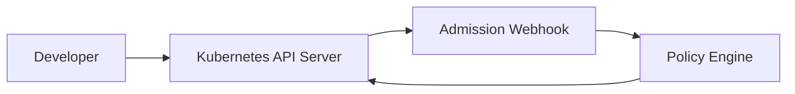

## Overview

Kubernetes Rate Limiter is a platform engineering project that explores how admission control can protect shared clusters from unsafe workload configuration and noisy-neighbor behavior.

The goal is to build a small, understandable service that enforces request policies before workloads reach the scheduler.

## Motivation

Multi-tenant clusters need guardrails. Teams should be able to deploy quickly, but the platform should still prevent common failure modes such as missing resource requests, extreme replica counts, or unsafe namespace defaults.

> [!NOTE] Platform guardrails
> A useful platform guardrail should be visible, documented, and easy to override through a reviewed path.

## Architecture



| Component | Responsibility |
| --- | --- |
| Admission webhook | Receives workload admission reviews |
| Policy engine | Evaluates namespace and workload limits |
| Metrics endpoint | Exposes allow and deny counters |

## Design decisions

- Keep policies explicit and easy to read.
- Prefer namespace-level configuration over global constants.
- Emit metrics for every decision.
- Fail closed only for critical policy paths.

## Challenges

Admission webhooks sit on a sensitive path. A broken webhook can block deployments, so timeout handling, certificate management, and rollout strategy matter as much as policy logic.

```go
type Decision struct {
	Allowed bool
	Reason  string
}
```

## Lessons learned

Simple policy checks become more useful when the platform gives teams clear feedback. A denial message should explain what failed and how to fix it.

## Screenshots


## Future improvements

- Add namespace-specific policy CRDs.
- Publish Prometheus dashboards.
- Add integration tests against a local kind cluster.
- Support dry-run policy evaluation.
